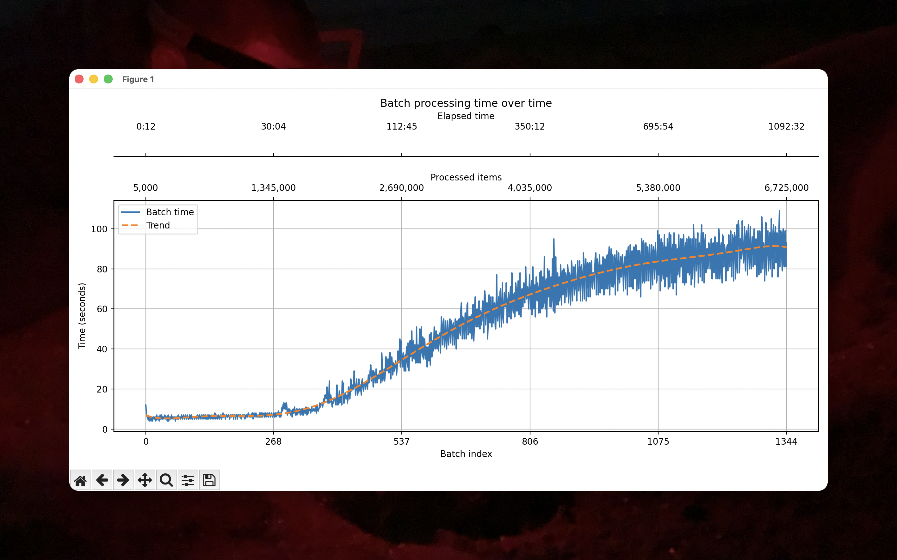

# Mini rapport - chargement de DBLP dans Neo4j

## Groupe

- **ID du groupe :** `TarritAdvDaBa26` (à confirmer)
- **Membres :** Vincent Tarrit (à compléter si nécessaire)

## Résumé de la solution

Le projet contient une application Java qui lit le fichier DBLP au format JSONL et insère les données dans une base Neo4j. Le chargement est exécuté dans Kubernetes avec deux composants principaux :

- un `Deployment` Neo4j, défini dans `kube/neo4j.yaml` ;
- un `Job` d'import, défini dans `kube/import-data.yaml`.

L'image Docker de l'importeur est construite à partir du `Dockerfile`. Elle compile le projet Maven puis lance la classe Java `mse.advDB.Example`.

## Étapes suivies

1. Construction de l'image Docker de l'importeur :

   ```bash
   docker buildx build --platform linux/amd64 -t vincenttarrit/neo4jtp:latest --push .
   ```

2. Nettoyage du namespace Kubernetes avant redéploiement :

   ```bash
   kubectl delete all --all -n tarrit-adv-daba-26
   ```

3. Déploiement de Neo4j :

   ```bash
   kubectl apply -f kube/neo4j.yaml -n tarrit-adv-daba-26
   ```

4. Lancement du job d'import :

   ```bash
   kubectl apply -f kube/import-data.yaml -n tarrit-adv-daba-26
   ```

5. Vérification des pods et des logs :

   ```bash
   kubectl get all -n tarrit-adv-daba-26
   kubectl logs <pod-importer> -n tarrit-adv-daba-26
   ```

## Fonctionnement du chargement

Le programme Java lit le fichier DBLP ligne par ligne depuis l'URL :

```text
http://vmrum.isc.heia-fr.ch/files/DBLP-Citation-network-V18.jsonl
```

Dans une première version, l'import était fait simplement ligne par ligne depuis le flux réseau. Cette approche fonctionnait, mais elle était fragile : en cas d'interruption réseau, il fallait recommencer le chargement depuis le début du fichier. Pour éviter ce problème, le programme lit maintenant le fichier distant octet par octet et garde en mémoire le nombre d'octets déjà lus. En cas de coupure, il peut rouvrir la connexion HTTP avec l'en-tête `Range` et reprendre la lecture à partir de l'octet voulu. Cette méthode permet donc de relancer l'import sans perdre tout le travail déjà effectué.

Chaque ligne JSON est transformée en un enregistrement contenant :

- un article avec le label `ARTICLE` et la propriété `_id` ;
- zéro ou plusieurs auteurs avec le label `AUTHOR` et la propriété `_id` ;
- des relations `AUTHORED` entre les auteurs et les articles ;
- des relations `CITES` entre les articles.

L'insertion se fait par lots de `5000` articles avec une requête Cypher utilisant `UNWIND`, `MERGE` et `SET`. Le programme crée aussi deux contraintes d'unicité :

```cypher
CREATE CONSTRAINT article_id IF NOT EXISTS FOR (a:ARTICLE) REQUIRE a._id IS UNIQUE;
CREATE CONSTRAINT author_id IF NOT EXISTS FOR (a:AUTHOR) REQUIRE a._id IS UNIQUE;
```

Ces contraintes évitent la création de doublons pour les articles et les auteurs.

## Namespace Kubernetes

Les jobs et deployments se trouvent dans le namespace suivant :

```text
tarrit-adv-daba-26
```

## Pod Neo4j

Le pod contenant Neo4j est :

```text
<à compléter avec la sortie de `kubectl get pods -n tarrit-adv-daba-26 -l app=neo4j`>
```

Commande de vérification :

```bash
kubectl get pods -n tarrit-adv-daba-26 -l app=neo4j
```

## Identifiants Neo4j

Les identifiants Neo4j sont définis dans `kube/neo4j.yaml` avec la variable `NEO4J_AUTH`.

```text
Utilisateur : neo4j
Mot de passe : test
URI Bolt : bolt://db:7687 depuis le namespace Kubernetes
Port HTTP : 7474
```

Pour vérifier les données, on peut exécuter par exemple :

```cypher
MATCH (a:ARTICLE) RETURN count(a) AS articles;
MATCH (au:AUTHOR) RETURN count(au) AS authors;
MATCH ()-[r:AUTHORED]->() RETURN count(r) AS authoredRelations;
MATCH ()-[r:CITES]->() RETURN count(r) AS citationRelations;
```

## Pod prouvant le chargement

Le chargement est effectué par le job Kubernetes `importer`. Le pod dont les logs prouvent le chargement est :

```text
<à compléter avec la sortie de `kubectl get pods -n tarrit-adv-daba-26 -l app=importer`>
```

Dans `deploy.sh`, un exemple de pod d'import apparaît :

```text
importer-wq64w
```

Commande pour récupérer les logs :

```bash
kubectl logs <pod-importer> -n tarrit-adv-daba-26
```

## Temps de chargement

Temps mesuré pour charger `N + K` nœuds :

```text
N articles : 6'729'949
K auteurs : 3'457'617
Total N + K : 10'187'566
Temps de chargement : 65'639 secondes
```

Ces valeurs ont été obtenues en exécutant la requête Cypher suivante dans le pod Neo4j :

```bash
kubectl exec -it pod/neo4j-57964d7b7c-z5gth -n tarrit-adv-daba-26 -- cypher-shell -u neo4j -p test
```

```cypher
MATCH (a:ARTICLE)
WITH count(a) AS N
MATCH (au:AUTHOR)
WITH N, count(au) AS K
RETURN N, K, N + K AS total;
```

Résultat obtenu :

```text
+------------------------------+
| N       | K       | total    |
+------------------------------+
| 6729949 | 3457617 | 10187566 |
+------------------------------+
```

Le nombre d'articles affiché par Neo4j (`6'729'949`) est légèrement supérieur au nombre d'articles lus dans les logs de l'importeur (`6'729'238`). Cette différence vient du fait que la requête d'import crée aussi des nœuds `ARTICLE` pour les références citées lorsqu'elles n'existent pas encore, afin de pouvoir créer les relations `CITES`.

Le chargement s'est terminé correctement avec le message suivant dans les logs :

```text
Finished. Inserted 6729238 articles in 65639 seconds.
[INFO] ------------------------------------------------------------------------
[INFO] BUILD SUCCESS
[INFO] ------------------------------------------------------------------------
[INFO] Total time:  18:14 h
[INFO] Finished at: 2026-05-04T04:47:58Z
[INFO] ------------------------------------------------------------------------
```

Le temps se récupère directement dans les logs du pod d'import. À la fin de l'exécution, le programme affiche une ligne de ce type :

```text
Finished. Inserted <N> articles in <temps> seconds.
```

La valeur `<temps>` correspond au temps total en secondes entre le début du chargement et la fin de l'insertion. Les logs intermédiaires contiennent aussi des lignes au format :

```text
<numero_batch>,<nombre_articles_chargés>,<temps_batch_secondes>,<temps_total_hh:mm:ss>
```

Ces lignes permettent de suivre la progression batch par batch et de retrouver le temps total au moment du dernier batch.

Un graphe peut aussi être généré avec le script Python `plot.py`. Ce script récupère les logs du pod d'import avec `kubectl logs`, ignore les lignes précédant la création des contraintes, puis analyse les lignes de progression produites par l'importeur. Il extrait notamment le nombre d'articles déjà traités, le temps du batch courant et le temps total écoulé. Le graphique obtenu permet de visualiser l'évolution du temps de traitement des batchs pendant l'import, avec une courbe de tendance. Les axes supérieurs indiquent aussi le nombre d'éléments traités et le temps écoulé, ce qui permet de relier facilement les performances observées à l'avancement réel du chargement.



Pour obtenir `N` et `K` après chargement, on peut utiliser :

```cypher
MATCH (a:ARTICLE) RETURN count(a) AS N;
MATCH (au:AUTHOR) RETURN count(au) AS K;
```

## Dépôt Git

Le code, les descripteurs Kubernetes, les scripts et les fichiers utiles sont disponibles dans le dépôt suivant :

```text
git@github.com:VincentTarritMaster/mse-advDaBa-2022.git
```

Lien clonable en HTTPS :

```text
https://github.com/VincentTarritMaster/mse-advDaBa-2022.git
```
